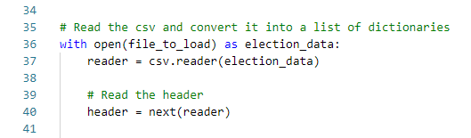
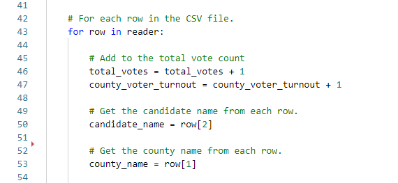
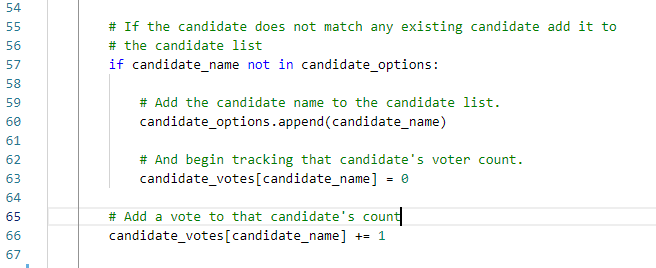
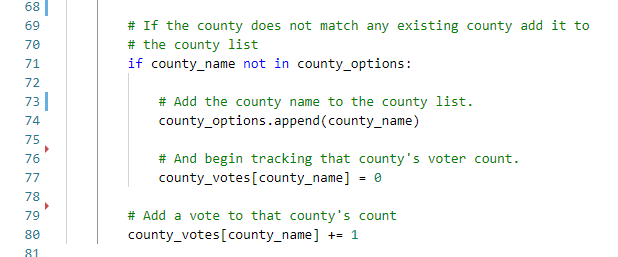
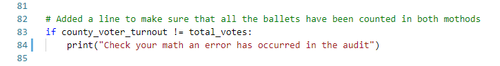
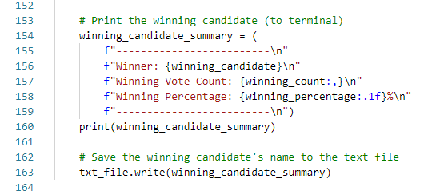
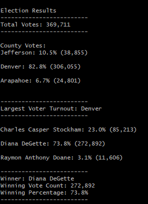
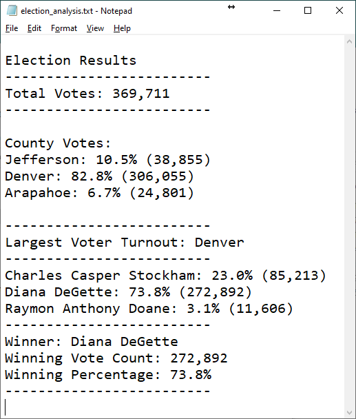

✓The written analysis has ALL of the following: ✓There is a title, and there are multiple sections. ✓Each section has a heading. ✓There are images and references to code, and they are formatted and displayed correctly.

✓The purpose is well defined. ✓ALL FIVE election outcomes are addressed. ✓There is a statement to the election commission on how this script can be used for any election with two examples given.

# Analysis of Election Results

## 1 Overview of Project

This project was the third challenge in the Carleton University Business Analytics and Data Visualization Boot Camp.  Module 3 of the of the boot camp was intended to help us, through the use of Python, build a foundation in programming and learn how to access, process, manipulate and store data.  The project involved the use of pseudo code to build the logical structure of the analysis and then to code in Python to complete the project objectives.

### 1.1 Purpose

The purpose of the specific project within this module was to assist a Colorado Board of Elections employee , Tom.  He will be conducting an election audit of the tabulated elections results for a US congressional precinct .  This is typically performed in Excel but Tom's boss, Seth, wants to know if in can be automated using Python.  We were provided with pseudo code that assess a few of the required results and we were asked to complete the program and provide a complete analysis for the results.

### 1.2 Approach

Working with a large data file of ballots, election_results.csv, the basis of the analysis was to extract candidate and county names and add them to lists that can then be used to enumerate the ballots.  To convert the csv file, we opened it and read it into a variable "reader" using the csv function reader(), which stores the file into a Python object.  This capability was made possible by importing the csv module which implements classes to read and write tabular data in csv format.  In Figure 1.1 you can see how the file is read and we extract its header by reading the first row of election_data into a variable "header".

  
**Figure 1.1 - Reading the csv file header**

The next step was to loop through the data row of reader to extract candidate and county name from the appropriate column if the row of data as shown in figure 1.2 below.

  
**Figure 1.2 - Looping through data rows**

In figure 1.3 you can see that we are extracting a unique list of candidates, and also enumerating information from the individual ballets and adding them to the candidate votes dictionary.

  
**Figure 1.3 - Building Candidate List and Candidate Vote Dictionary**

In a similar fashion, in figure 1.4 you can see that we are extracting a unique list of county name, and also enumerating information from the individual ballets and adding them to the county votes dictionary.

  
**Figure 1.4 - Building County List and County Vote Dictionary**

In figure 1.5 we check the total votes cast for all candidates against the total votes cast in all counties.  These numbers by definition should match, so if they do not than an error has occurred and the code and/or data would then need to be checked for a cause.

  
**Figure 1.5 - Cross Checking the Total Vote Count**

The last and most important part was to output the results both to the screening as well as a text file.  The code for this is shown in figure 1.6, it include another class from the csv library that facilitates writing to a text file.

  
**Figure 1.6 - Writing the Result to the Screen and a File**

### 1.3 Challenges

There were a few challenges in working on this project and they were because I have used much older programming languages like Fortran.  We also just completed a unit using Visual Basic scripts in macro enabled Excel spreadsheets.  This was my first time working with Python and as a result here is the list of the issues that I faced:

- The biggest challenge was the fact that Python is so very dependent on indentation to determine the end of loops and conditional branches.   A great amount of attention is require to make sure the code is being read as you intended it to be.
- Capitalization (or should I say non-capitalization) for key words - "**for** example **For**" 
- Python has a large number of available coding methods and libraries that can make you life very easy, the challenge is finding out what is available.  Reviewing lots of other code helps expose you to some new efficencies, like the use of x += 1 can replace x = x =1, very simple and very useful indeed. 

## 2 Analysis and Observations
### 2.1 Audit of the Election Results

Figure 2.1 below was captured using the "Save as Image" right click feature in GitBash.

  
**Figure 2.1 - Election Results as View on Screens**

The results of the election were also written to a text file, "election_analysis.txt.  Figure 2.2 is a screen shot of that file when opened in Notepad.

  
**Figure 2.2 - Election Results as Written to a Text File**

The program correctly captures the required data and displaces it clearly both directly on the screening and in the required text file format. 

### 2.2 Observations

The first important observation is that the sum of ballets equals 369,711 when count by ballets from a county or ballets for a given candidate.  It is important to confirm the validity of the results by appropriately cross check the data for the possibly of errors.  As illustrated in the approach section above, figure 1.5 our program would have display an error message if these two method resulted in a different count of total ballets.

#### 2.2.1 Review of County Data

The results did show that at 82.8% of the county votes, Denver contributed to the vast majority of the quotes.   This is a very surprising result since Jefferson, Denver, and Arapahoe are amount the largest counties in Colorado with reasonably comparable populations.  I am concerned that not all of the ballets are represented in the data that has been provided for audit.  I recommend that the data source be thoroughly reviewed for missing ballet sources.

#### 2.2.2 Review of Candidate Data

The results did show that Diana DeGette was determined to have been the winner with an overwhelming 73.8% of the total votes counted.  Unfortunately, based on the county data findings in section 2.2.1 it would not be possible to certify the results until such time a the county based missing ballet issue has been resolved.

### 2.3 Overview of Analysis
#### What do we know?  
Elections are very important as they affect the future of all citizens and they therefore need to represent everyone who has casted a ballot: 
- What we do know is that the Python program works effectively and without error..  
- We also know that the end there appears to be missing data sources that are not in the data that has been provided.

#### What don't we know?
As is often the case there are always going to be more information required:
- First of all, we don't know the history of this data - maybe it is very old and Denver was way bigger than the other counties at that time 
- We also don't know if maybe we are just analyzing test data to see if we really would be able to find data discrepancies 

#### How can we help?  
It is my option that Tom's boss Seth was just trying to see how well the Python fill would work, and I would have to say that we passed the test.    It is apparent that Seth is a forward thinking man and is likely looking to get a bigger job within the state of Colorado.   I think what we have to do to help him with he lofting goal is to:

- Asks him for a complete set of data so that we can prove that the program will work on a much larger data set.
- Prepare a detailed briefing for an assist Seth when pitching a statewide audit system that he would be in charge of.

I would recommend that Tom further engage my consulting services to determine if, through the analysis of more information, the auditing capability can be enhanced.  Knowing what percentage of county votes went to a particular candidate, for example, may be of value in determining other voting irregularities.
